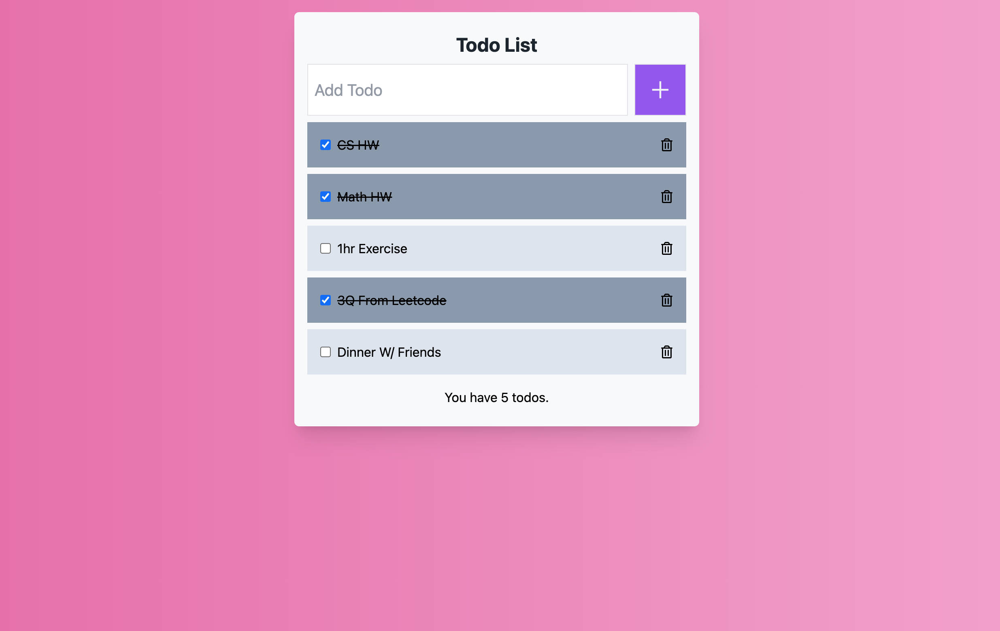

# Todo List (React + Firebase)

Elevate Your Productivity with Professional Task Management

## **Introduction**

MyToDo is your ultimate task management website, designed to boost your productivity. Here, you can effortlessly save and organize your to-do items, mark them as complete, and tidy up your list by hiding or deleting tasks you no longer need.

### **Features:**

1. **Task Storage:** MyToDo keeps all your tasks neatly organized for quick reference. Easily add new tasks with a simple click and set priorities for each item.
2. **Checkmark Completion:** Marking tasks as complete is a breeze. Keep your completed tasks distinct and clear.
3. **Hide Tasks:** Hide tasks you no longer want to see with just a single click. Maintain a clutter-free list.
4. **Task Deletion:** Remove unnecessary tasks instantly. Keep your list clean and avoid any confusion from irrelevant information.

   

#### **Why MyToDo?**

MyToDo goes beyond a simple to-do list. Our user-centric design and intuitive interface make it easy for anyone to use. Manage your tasks more efficiently and accomplish more in less time.

##### **In Conclusion:**

Try MyToDo for effortless task management in your daily life. With MyToDo, you can efficiently organize and successfully complete your tasks.
